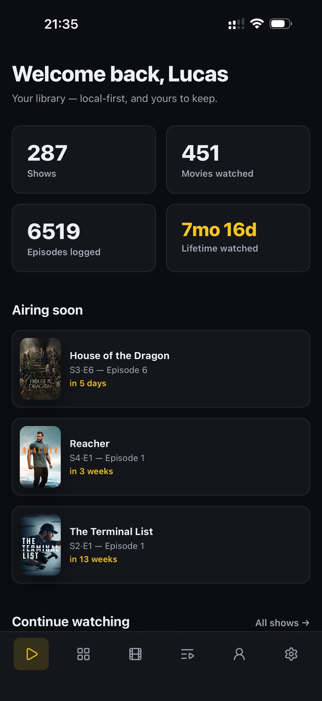
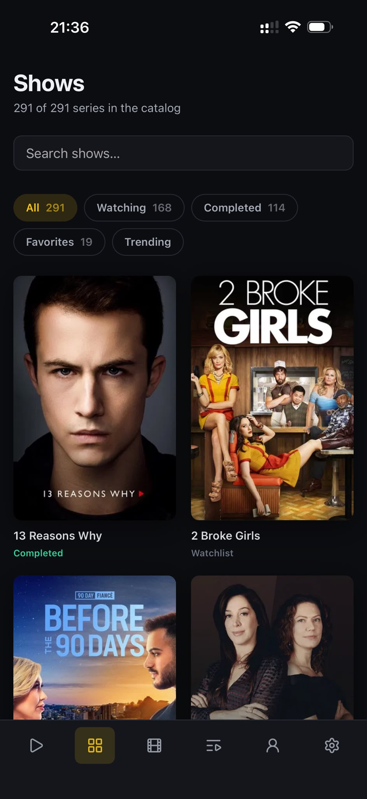
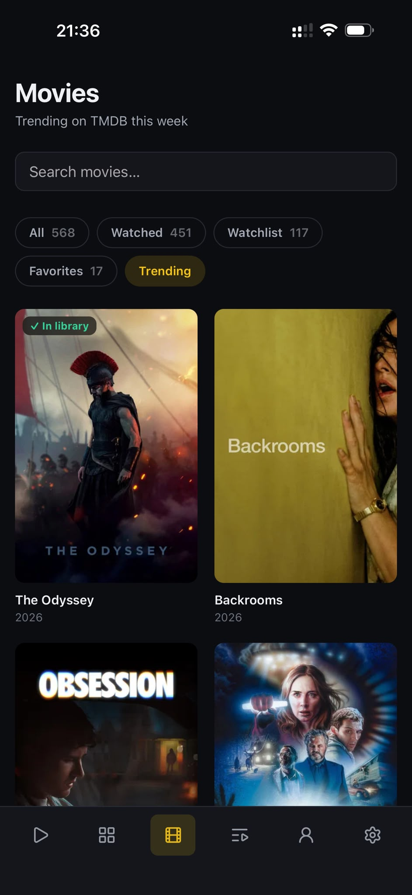
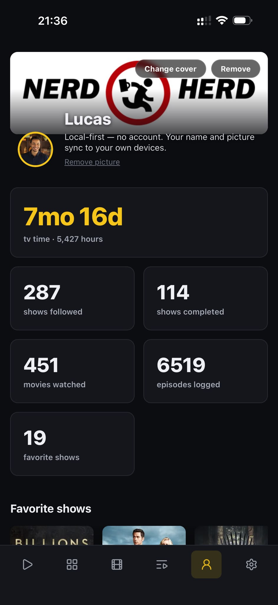
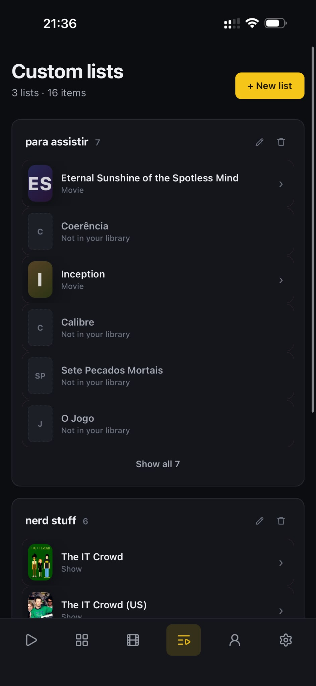
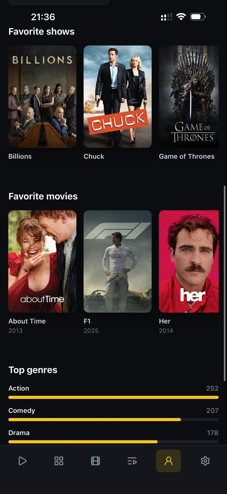
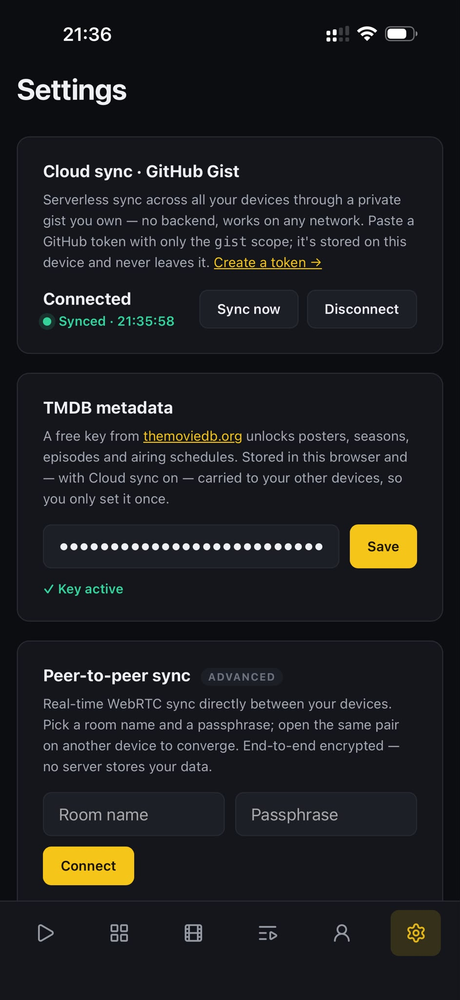

<div align="center">

# 📺 TV Time Revival

**The service shut down. The library didn't.**

A decentralized, local-first PWA that resurrects a **TV Time** library from an on-device
backup — and turns it into a tracker that can never be switched off again.

<br/>

`No database` · `No server` · `No account` · `Your data, your devices`

<br/>


<br/>






</div>

---

## Why this exists

TV Time's backend was decommissioned. The only surviving copy of the library was the
app's own on-device cache, pulled via `adb backup`. This project treats that snapshot as
the source of truth and rebuilds a full tracker on top of it — one that never depends on
anyone else's servers staying alive again.

Recovered from the backup: **288 shows**, **565 movies**, watch history, favorites, and
custom lists — every show carrying a stable TheTVDB id, so metadata still resolves years
later.

## A look around

<table>
<tr>
<td width="33%" valign="top">
<br/>
<b>Home</b><br/>
Lifetime stats, what's airing next, and a continue-watching rail straight to the next episode.
</td>
<td width="33%" valign="top">
<br/>
<b>Shows</b><br/>
The whole library, filterable by watching / completed / favorites — plus what's trending now.
</td>
<td width="33%" valign="top">
<br/>
<b>Movies</b><br/>
Watched, watchlist and favorites, with TMDB trending marked <i>✓ In library</i> at a glance.
</td>
</tr>
<tr>
<td valign="top">
<br/>
<b>Custom lists</b><br/>
Your original TV Time lists, intact — including entries that never made it into the library.
</td>
<td valign="top">
<br/>
<b>Profile</b><br/>
Favorites, top genres, and the number that hurts: <b>7mo 16d</b> of lifetime watch time.
</td>
<td valign="top">
<br/>
<b>Settings</b><br/>
One TMDB key, one gist token — sync across every device with nothing running in between.
</td>
</tr>
</table>

## Architecture

```
Angular 20 PWA (static, service-worker cached, installable)
        │
   LibraryStore (Angular signals)
        │  merges …
        ├── Catalog  ── public/seed.json  (immutable, identical on every device, never synced)
        └── User state ── Yjs CRDT ── y-indexeddb (local persistence)
                                   ├── GitHub Gist (serverless cloud sync)
                                   └── y-webrtc    (E2E-encrypted P2P sync, optional)
        │
   TMDB service ── Cache-API content-addressed cache (posters, seasons, episodes)
```

**The key split.** The 600 KB catalog is baked into the app and loaded identically
everywhere, so it never travels over the wire. Only *mutable, mergeable facts* — what
you've watched, your watchlist, ratings, favorites, list edits — live in the Yjs
document. That doc is tiny, conflict-free (CRDT), persisted in IndexedDB, and the only
thing that ever syncs.

**Sync without a backend.** Cloud sync stores the whole CRDT state in a **private gist you
own** and pull-merges-pushes on every device. `y-webrtc` is the real-time alternative:
devices find each other through a signaling server, then exchange updates directly,
encrypted with a passphrase only they know — the signaling server only ever relays opaque
blobs. That rendezvous point is the one piece WebRTC can't do without, so it ships with
the project: `signaling/` is a ~150-line Cloudflare Worker (Durable Objects, hibernating
sockets) deployed at `wss://tv-time.lucasluizss.workers.dev`, and any other y-webrtc
server can be swapped in from Settings. JSON **export/import** is the always-works floor
beneath both.

**Metadata** comes from TMDB at runtime, resolved by the `tvdb_id`/`imdb_id` recovered in
the seed — exact lookups, not fuzzy title search. Responses are cached by URL via the
Cache API, so each id maps to one entry, works offline once fetched, and never re-hits
the network within its TTL.

## Data pipeline (`tools/build-seed.py`)

Turns the raw backup into `public/seed.json`. The clever bit: `followed_shows.csv` ships
with **no ids**, but the app's cached API responses (`diocache-json/`) carry each show's
TheTVDB id, joinable by `uuid` — so every one of the 288 shows recovers a stable id for
TMDB enrichment, plus any cached TheTVDB poster URLs.

```bash
TVTIME_BACKUP=/path/to/tvtime-backup/account npm run seed
```

Produces 288 shows (all with TVDB ids + posters), 565 movies, 452 watched-movie records,
43 cached watched episodes, favorites, and 3 custom lists.

> [!NOTE]
> Episode-level history is only the cached subset — the backend died before a full sync.
> Shows and movies are complete at the library level; use **"mark watched up to here"** on
> a show to backfill episode progress.

## Run it

```bash
npm install
npm run seed        # generate public/seed.json from the backup (once)
npm start           # → http://localhost:4200
```

First launch imports the seed into the CRDT and persists it to IndexedDB. Reloads and
offline use are instant thereafter.

<details>
<summary><b>Enable posters & "what's airing"</b></summary>

Settings → paste a free [TMDB API key](https://www.themoviedb.org/settings/api). With
Cloud sync on, the key travels to your other devices, so you set it once. Even without a
key, shows display recovered TheTVDB artwork.
</details>

<details>
<summary><b>Sync across your devices</b></summary>

- **Cloud sync · GitHub Gist** *(recommended)* — Settings → paste a GitHub token scoped to
  `gist` only. Truly serverless, works across any network. The token stays in this
  device's IndexedDB and never enters the synced data.
- **Peer-to-peer · WebRTC** — Settings → pick a room name + passphrase; open the same pair
  on another device for real-time P2P. Uses this project's own signaling Worker by default
  (`signaling/`), and any other y-webrtc relay can be pasted in Settings.
- **Link a device (QR)** — Settings → *Link a device* shows a two-minute QR code. Scan it
  with the new device's own camera and it lands fully configured: joined to the P2P room
  and holding the gist token, with no credential typed twice. The code carries only a
  throwaway room id + key; the credentials travel inside that end-to-end-encrypted room,
  which is destroyed once the handshake completes. A P2P room is minted on the spot if the
  fleet doesn't have one yet.
- **Public profile** *(off by default)* — Profile → *Make profile public* publishes a
  snapshot (name, handle, picture, cover, member-since year, totals, favorites, top genres)
  to a **second, public gist** and gives you a link to `/u/<gist-id>`. Nothing is shared
  until you turn it on, and *Make profile private* deletes that gist, so shared links stop
  working immediately. Your watch history, screen time, settings, timezone and tokens are
  never included — the private sync gist and the public one are separate files by design.
  Note that GitHub *lists* public gists on your profile, so the page is findable there and
  not only through the link you send; the confirmation dialog says so before you publish.
- **Active sessions** — Settings lists every linked device, live dot from WebRTC awareness,
  last-seen from the synced roster. Signing one out is cooperative (no server to enforce
  it): the device drops its credentials next time it connects.

Either way, CRDT merges are conflict-free and offline edits reconcile on reconnect.
</details>

## Build & deploy — static, host anywhere

```bash
npm run build                                    # → dist/tvtime-revival/browser
npm run build -- --base-href /tvtime-revival/    # GitHub Pages / subpath hosting
```

Drop the `browser/` folder on GitHub Pages, Netlify, Cloudflare Pages, or any static
host. There is nothing else to run.

## Project layout

```
tools/build-seed.py            Backup → seed.json pipeline
public/seed.json               The immutable catalog (generated)
src/app/core/
  models.ts                    Domain + view models
  seed.service.ts              Loads the catalog, id lookups
  doc.service.ts               Owns the Yjs doc, IndexedDB, bootstrap, export/import
  library.store.ts             Signal facade: catalog × user state → view models + mutations
  github-api.service.ts        One throttled, rate-limit-aware pipe to the GitHub API
  public-profile.service.ts    Opt-in public profile page: publish / take down / snapshot
  tmdb.service.ts              TMDB resolution + Cache-API caching
  sync.service.ts              y-webrtc E2E-encrypted P2P sync
  pairing.service.ts           QR device linking — one-shot encrypted handshake room
  device.service.ts            Device identity, session roster, presence, sign-out
src/app/features/              home · shows · show-detail · movies · lists · profile · settings · link
src/app/shared/poster.ts       Lazy, self-healing poster (TMDB → cached → gradient)
src/app/shared/qr-code.ts      QR code as a single resolution-independent SVG path
signaling/                     WebRTC signaling relay (Cloudflare Worker + Durable Objects)
```

---

<div align="center">

Built from <code>asyncLucas</code>'s TV Time backup.<br/>
<b>Your history, kept alive — decentralized and yours.</b>

</div>
